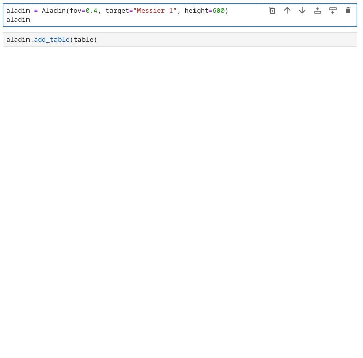

# ipyaladin

A bridge between Jupyter and Aladin Lite, enabling interactive sky visualization in IPython notebooks.
With a couple of lines, you can display Aladin Lite, center it on the target of your choice, and overlay an Astropy table:


- [ipyaladin](#ipyaladin)
  - [Examples](#examples)
  - [Installation](#installation)
  - [New features corner](#new-features-corner)
  - [Development installation](#development-installation)

## Examples

Some example notebooks can be found in the [examples directory](examples).

[](https://mybinder.org/v2/gh/cds-astro/ipyaladin/master). You can also try it directly [in mybinder](https://mybinder.org/v2/gh/cds-astro/ipyaladin/master), without installing anything.

## Installation

To install use pip or conda :

```shell
> pip install ipyaladin
> # OR
> conda install -c bmatthieu3 ipyaladin
```

You can already try to load ipyaladin in a notebook.

```python
from ipyaladin import Aladin
aladin = Aladin()
aladin
```

If it does not work, make sure to enable `widgetsnbextension` and `ipyaladin`:

```shell
> jupyter nbextension enable --py widgetsnbextension
> jupyter nbextension enable --py --sys-prefix ipyaladin
```

Additionny, for a jupyterlab < 4 usage you will need to 
(note that this is not needed for jupyterlab >= 4.0):

```shell
> jupyter labextension develop ipyaladin --overwrite
```

## New features corner



## Development installation

First, make sure you have installed jupyter on your python environnement: `pip install jupyter`.
For a development installation [Node.js](https://nodejs.org) and [Yarn version 1](https://classic.yarnpkg.com/) are also required,

    git clone https://github.com/cds-astro/ipyaladin.git
    cd ipyaladin
    npm install yarn
    cd js
    npm install
    cd ..
    pip install -e .

For Jupyter Notebook, do
 
    jupyter nbextension install --py --symlink --overwrite --sys-prefix ipyaladin
    jupyter nbextension enable --py --sys-prefix ipyaladin

For JupyterLab, you will need to run this command too:

    jupyter labextension develop --overwrite ipyaladin

Then you need to rebuild the JS when you make a code change:

    cd js
    yarn run build

You then need to refresh the JupyterLab page when your javascript changes.
