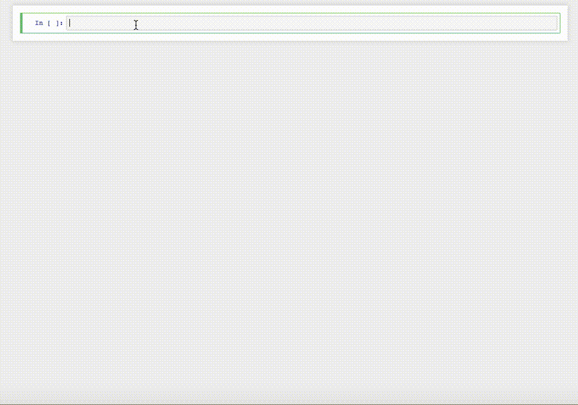

# ipyaladin

[](https://cds-astro.github.io/ipyaladin/)

A bridge between Jupyter and Aladin Lite, enabling interactive sky visualization in IPython notebooks.
With a couple of lines, you can display Aladin Lite, center it on the target of your choice, and overlay an Astropy table:



- [ipyaladin](#ipyaladin)
  - [Examples](#examples)
    - [A subset of examples](#a-subset-of-examples)
  - [Installation](#installation)
  - [Development installation](#development-installation)
  - [How does it work?](#how-does-it-work)
  - [Works with](#works-with)
    - [Actively tested](#actively-tested)
    - [Not actively tested](#not-actively-tested)
  - [Acknowledging ipyaladin](#acknowledging-ipyaladin)

## Examples

Some example notebooks can be found in the [examples directory](examples).

### A subset of examples

<!-- Examples -->
<table><tbody>
<tr>
  <td align="center">basic commands</td>
  <td align="center">importing tables</td>
  <td align="center">display MOCs</td></tr><tr>
    <td align="center"><a href="https://cds-astro.github.io/ipyaladin/_collections/notebooks/02_Base_Commands.html">
      </img></a></td>
    <td align="center"><a href="https://cds-astro.github.io/ipyaladin/_collections/notebooks/04_Importing_Tables.html">
      </img></a></td>
    <td align="center"><a href="https://cds-astro.github.io/ipyaladin/_collections/notebooks/05_Display_a_MOC.html">
      </img></a></td></tr><tr>
  <td align="center">display sky regions</td>
  <td align="center">retrieve data from the widget</td>
  <td align="center">advanced app</td></tr><tr>
    <td align="center"><a href="https://cds-astro.github.io/ipyaladin/_collections/notebooks/09_Displaying_Shapes.html">
      </img></a></td>
    <td align="center"><a href="https://cds-astro.github.io/ipyaladin/_collections/notebooks/11_Extracting_information_from_the_view.html">
      </img></a></td>
    <td align="center"><a href="https://cds-astro.github.io/ipyaladin/_collections/notebooks/10_Advanced-GUI.html">
      </img></a></td></tr>
</tbody></table>
<!-- Examples -->

[](https://mybinder.org/v2/gh/cds-astro/ipyaladin/master). You can also try it directly [in mybinder](https://mybinder.org/v2/gh/cds-astro/ipyaladin/master), without installing anything.

## Installation

To install use pip or conda :

```shell
> pip install ipyaladin
```

You can already try to load ipyaladin in a notebook.

```python
from ipyaladin import Aladin
aladin = Aladin()
aladin
```

## Development installation

First, make sure you have installed jupyter in your python environnement: `pip install jupyter`.
For a development installation [Node.js](https://nodejs.org) and [Yarn version 1](https://classic.yarnpkg.com/) are also required,

```shell
> git clone https://github.com/cds-astro/ipyaladin.git
> cd ipyaladin
> npm install
> npm run dev
```

And you are ready to develop! Any change done in the python, javascript, or css files should
be directly reflected in the notebook editor of your choice (JupyterLab, VSCode,...)!

## How does it work?

Ipyaladin brings [Aladin Lite](https://github.com/cds-astro/aladin-lite) into notebooks thanks to
[Anywidget](https://anywidget.dev/).

Correspondence table between ipyaladin versions and Aladin Lite versions:

| ipyaladin  | Aladin-Lite |
| ---------- | ----------- |
| Unreleased | 3.5.1-beta  |
| 0.5.2      | 3.5.1-beta  |
| 0.5.1      | 3.5.1-beta  |
| 0.5.0      | 3.5.1-beta  |
| 0.4.0      | 3.4.4-beta  |
| 0.3.0      | 3.3.3-dev   |

> [!TIP]
> This can always be read like so
>
> ```python
> from ipyaladin import __version__, __aladin_lite_version__
> print("version:", __version__, "running Aladin Lite:", __aladin_lite_version__)
> ```
>
> ```
> version: 0.4.0 running Aladin Lite: 3.4.4-beta
> ```

## Works with

### Actively tested

- [JupyterLab / Jupyter Notebook](https://jupyter.org/)
- [JupyterLite](https://jupyterlite.readthedocs.io/en/stable/)
- [VSCode Jupyter](https://github.com/microsoft/vscode-jupyter)

These are tested for each release.

### Not actively tested

- [Marimo](https://marimo.io/)
- [PyCharm Notebooks](https://www.jetbrains.com/help/pycharm/jupyter-notebook-support.html)
- [Voilà / Voici](https://github.com/voila-dashboards)
- [Google Colab](https://colab.research.google.com/)
- [Panel](https://panel.holoviz.org/)

We know that it works, but we don't track the bugs ourselves. Feel free to open an issue if something is not working anymore. You can also contribute to this list if you know of an other notebook environment where `ipyaladin` works.

## Acknowledging ipyaladin

If you use `ipyaladin` for your work or research, we kindly ask you to cite it with the following acknowledgment:

> This research made use of ipyaladin, developed by CDS, Strasbourg Astronomical Observatory, France (DOI: [10.26093/kpaw-kb74](https://doi.org/10.26093/kpaw-kb74) ).
>
> [2020ASPC..522..117B](https://ui.adsabs.harvard.edu/abs/2020ASPC..522..117B) - ipyaladin: Enabling Aladin Lite in Jupyter Notebooks (Boch T. et al.)
